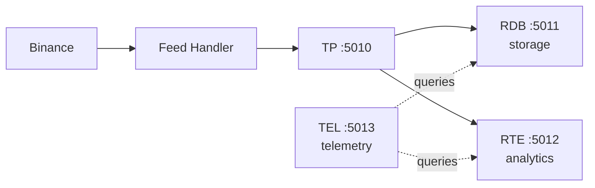

# Real-Time Event-Driven Market Data System

A real-time, event-driven Binance trades pipeline built with C++ and kdb+/KDB-X. Inspired by the article *Building Real-Time Event-Driven KDB-X Systems* by Data Intellect.

The original article has been carefully rewritten and restructured to be LLM-friendly, while (hopefully) preserving the depth, precision, and engineering intent of the source material. The rewritten version kdbx-real-time-architecture-reference is available as a Markdown document in the docs/ directory, alongside a set of Architecture Decision Records (ADRs) in the docs/decisions. Together, these documents serve as both a technical reference and a companion to the implementation in this repository.


## Architecture



| Component | Port | Role |
|-----------|------|------|
| TP | 5010 | Tickerplant - pub/sub distribution |
| RDB | 5011 | Real-Time Database - storage only |
| RTE | 5012 | Real-Time Engine - rolling analytics |
| TEL | 5013 | Telemetry - aggregates latency/throughput metrics |
| FH | - | Feed Handler - WebSocket to IPC |

## What This Project Does

- Ingests **real-time trade data** from Binance (BTCUSDT, ETHUSDT)
- Captures **latency measurements** at every pipeline stage
- Publishes via **IPC** to a kdb+ tickerplant with pub/sub
- Stores trades with **full instrumentation** (14 timestamp/latency fields)
- Computes **rolling analytics** (5-minute average price, trade count)
- Aggregates **telemetry metrics** (p50/p95/max latencies, throughput) every 5 seconds

## Quick Start

```bash
# Terminal 1: Start Tickerplant
q kdb/tp.q

# Terminal 2: Start RDB
q kdb/rdb.q

# Terminal 3: Start RTE
q kdb/rte.q

# Terminal 4: Start TEL
q kdb/tel.q

# Terminal 5: Build and run Feed Handler
cmake -S . -B build
cmake --build build
./build/binance_feed_handler
```

Or use the tmux launcher:
```bash
./start.sh
```

## Verify It Works

**RDB (port 5011)** - raw trades:
```q
select count i by sym from trade_binance
select from -5#trade_binance
```

**RTE (port 5012)** - rolling analytics:
```q
rollAnalytics
/ isValid flips to 1b once window is 50% filled (~2.5 min)
```

**TEL (port 5013)** - telemetry:
```q
select from telemetry_latency_e2e where bucket = max bucket
select from telemetry_latency_fh where bucket = max bucket
select from telemetry_throughput where bucket = max bucket
select from telemetry_analytics_health where bucket = max bucket
```

## Configuration

### Adding/Removing Symbols

Edit the `SYMBOLS` vector in `src/feed_handler.cpp`:

```cpp
const std::vector<std::string> SYMBOLS = {
    "btcusdt",
    "ethusdt"
    // Add more symbols here (lowercase)
};
```

Rebuild and restart the feed handler. No changes needed to kdb+ components.

### RTE Parameters

Edit the configuration section at the top of `kdb/rte.q`:

```q
.rte.cfg.windowNs:5 * 60 * 1000000000j;  / Rolling window: 5 minutes
.rte.cfg.validityThreshold:0.5;          / 50% fill required for validity
```

### TEL Parameters

Edit the configuration section at the top of `kdb/tel.q`:

```q
.tel.cfg.bucketSec:5;        / Telemetry bucket size
.tel.cfg.retentionMin:15;    / Retention period
```

## Data Flow

```
FH --> TP --+--> RDB (storage)
            |
            +--> RTE (analytics)

TEL <-- queries both on timer
```

RDB and RTE are **peer subscribers** to the tickerplant. Each receives every trade independently. TEL queries both to aggregate metrics.

## Latency Measurement Points

| Field | Source | Description |
|-------|--------|-------------|
| `fhRecvTimeUtcNs` | FH | Wall-clock when WebSocket message received |
| `fhParseUs` | FH | Parse/normalise duration (monotonic) |
| `fhSendUs` | FH | IPC send prep duration (monotonic) |
| `tpRecvTimeUtcNs` | TP | Wall-clock when TP receives message |
| `rdbApplyTimeUtcNs` | RDB | Wall-clock when trade is query-consistent |

## Telemetry Tables (TEL)

| Table | Contents |
|-------|----------|
| `telemetry_latency_fh` | FH segment latencies (p50/p95/max) by symbol |
| `telemetry_latency_e2e` | Cross-process latencies (FH->TP->RDB) by symbol |
| `telemetry_throughput` | Trade counts and volumes by symbol |
| `telemetry_analytics_health` | RTE validity status by symbol |

## Rolling Analytics (RTE)

| Field | Description |
|-------|-------------|
| `lastPrice` | Most recent trade price |
| `avgPrice5m` | 5-minute rolling average price |
| `tradeCount5m` | 5-minute rolling trade count |
| `isValid` | True if window >= 50% filled |
| `fillPct` | Percentage of window with data |
| `windowStart` | Oldest trade time in window |
| `updateTime` | Last analytics update time |

## Project Structure

```
.
├── CMakeLists.txt
├── src/
│   ├── main.cpp
│   └── feed_handler.cpp          # C++ WebSocket client + IPC publisher
├── kdb/
│   ├── tp.q                      # Tickerplant with pub/sub
│   ├── rdb.q                     # RDB - storage only
│   ├── rte.q                     # RTE - rolling analytics
│   └── tel.q                     # TEL - telemetry aggregation
├── third_party/
│   └── kdb/
│       ├── k.h                   # kdb+ C API header
│       └── c.o                   # kdb+ C API library
├── start.sh                      # tmux launcher
├── stop.sh                       # Stop all processes
└── docs/
    ├── README.md
    ├── kdbx-real-time-architecture-reference.md
    ├── kdbx-real-time-architecture-measurement-notes.md
    ├── api-binance.md
    ├── specs/
    │   └── trades-schema.md      # Canonical schema definition
    └── decisions/
        ├── adr-001-timestamps-and-latency-measurement.md
        ├── adr-002-feed-handler-to-kdb-ingestion-path.md
        ├── adr-003-tickerplant-logging-and-durability-strategy.md
        ├── adr-004-real-time-rolling-analytics-computation.md
        ├── adr-005-telemetry-and-metrics-aggregation-strategy.md
        ├── adr-006-recovery-and-replay-strategy.md
        ├── adr-007-visualisation-and-consumption-strategy.md
        └── adr-008-error-handling-strategy.md
```

## Design Principles

- **Documentation-first**: Architecture decisions documented before code
- **Measurement discipline**: Latency captured at every stage with explicit trust model
- **Event-driven**: Tick-by-tick processing, no batching
- **Separation of concerns**: Storage (RDB), Analytics (RTE), Telemetry (TEL)
- **Ephemeral by design**: No persistence; focus on real-time behaviour

## Implementation Status

| Component | Status | Notes |
|-----------|--------|-------|
| Feed Handler | Complete | Multi-symbol, full instrumentation |
| Tickerplant | Complete | Pub/sub, timestamp capture |
| RDB | Complete | Storage only (telemetry moved to TEL) |
| RTE | Complete | Rolling analytics, validity tracking |
| TEL | Complete | Queries RDB+RTE, aggregates metrics |
| Dashboards | Planned | KX Dashboards visualisation |


## Dependencies

- **C++17** compiler (GCC/Clang)
- **CMake** 3.16+
- **Boost** (Beast, Asio)
- **OpenSSL**
- **RapidJSON**
- **kdb+** 4.x (with valid license)
- **tmux** (optional, for start.sh)

## Documentation

| Document | Purpose |
|----------|---------|
| [Architecture Reference](docs/kdbx-real-time-architecture-reference.md) | Design patterns for real-time KDB-X systems |
| [Measurement Notes](docs/kdbx-real-time-architecture-measurement-notes.md) | Latency measurement definitions and trust model |
| [Trades Schema](docs/specs/trades-schema.md) | Canonical schema with all 14 fields |
| [ADRs](docs/decisions/) | Architecture Decision Records |

## License

This project is for educational and exploratory purposes.

## Acknowledgements

Architecture patterns derived from [Building Real Time Event Driven KDB-X Systems](https://dataintellect.com/) by Data Intellect.
